# gumdrop

  

  <em>Multipurpose, asynchronous, non-blocking, event-driven Java multiserver and servlet container</em>

  
  
  

---

This is gumdrop, a multipurpose Java server framework using asynchronous,
non-blocking, event-driven I/O. It supports:
- a generic, extensible server framework that can transparently handle TLS
  connections from clients
    - TCP servers with TLS support
    - UDP servers with DTLS support
    - fully transparent SSL support
        - keystore/truststore configuration
        - client certificates
        - SSL protocols (TLS 1.2, 1.3)
        - cipher suite selection
        - SNI
    - configurable pool of worker threads shared across all servers,
      completely independent of the number of client connections
    - internationalization and localization facilities, current translations
      include:
        - English
        - French
        - Spanish
        - German
    - centralized and secure realm interface for authentication and
      authorization
    - connection filtering, rate limiting, quota features
    - centralized authentication and authorization realm interface
      usable by multiple servers
    - client framework for creating clients to communicate with other servers
        - uses same event-driven asynchronous architecture for peers
- HTTP
    - versions 1.0 and 1.1
        - Chunked encoding
    - HTTP/2
        - all HTTP/2 frame types
        - HPACK compression
    - WebSockets
    - HTTPS with client certificate authentication, custom SSL parameters
      and cipher suites
    - authentication framework supporting various methods
        - Basic
        - HTTP Digest
        - Bearer
        - OAuth
    - simple file-based HTTP server
        - supports fast NIO based data transfer
        - PUT and DELETE
    - complete, conformant Java servlet 4.0 container
        - hot deployment
        - session management and clustering/replication facilities
        - complete multipart/form-data handling
        - annotation-driven configuration and web fragments
        - programmatic registration of web descriptors
        - asynchronous processing
        - enterprise DataSource and MailSession handling, JCA connection
          factories and administered objects
        - secure classloader separation
        - enterprise JNDI integration
        - separate thread pool configuration for servlet worker threads,
          distinct from I/O worker loops
        - WebSocket servlet support with example showing how to use upgrade
        - server push
        - form-based and client certificate authentication in addition to
          base HTTP authentication methods
        - JSP 2.0 implementation
        - cluster session replication with security features:
            - AES-256-GCM encryption with shared secret
            - replay protection via sequence numbers and timestamps
            - per-node sequence tracking with sliding window
            - protobuf serialization for session attributes
            - deserialization filtering for complex objects
- SMTP
    - SMTPS
    - STARTTLS support
    - SMTP AUTH with numerous authentication methods for both standard
      clients and enterprise/military environments (see SASL section below)
    - 8-bit clean message transport
    - memory efficient processing of large messages
    - attack prevention features
    - persistent connections
    - transaction reset
    - connection filtering policy settings for MTA mode or message submission
        - rate limiting
        - network block lists
        - max connections per IP
        - require authentication
    - simple, extensible asynchronous handler mechanism for implementations
    - SMTP client implementation for MTA forward message delivery
        - simple asynchronous handler mechanism for event-driven client
        - supports TLS connections and STARTTLS
- IMAP4rev2
    - complete IMAP4rev2 implementation (RFC 9051)
    - IMAPS (implicit TLS on port 993)
    - STARTTLS support
    - full SASL authentication (see SASL section below)
    - multi-folder mailbox support with hierarchical namespaces
    - supported extensions:
        - IDLE (RFC 2177) - push notifications for mailbox changes
        - NAMESPACE (RFC 2342) - personal/shared namespace support
        - QUOTA (RFC 9208) - storage and message quotas
            - respects quotas defined in configuration
        - MOVE (RFC 6851) - atomic message move operations
        - UIDPLUS - extended UID operations
        - UNSELECT - close without expunge
        - CHILDREN - mailbox hierarchy indicators
        - LIST-EXTENDED, LIST-STATUS - enhanced mailbox listing
    - comprehensive SEARCH command with full RFC 9051 syntax
        - flag, date, size, header, and body searches
        - boolean operators (AND, OR, NOT)
        - sequence sets and UID sets
    - pluggable mailbox backend via standardized API
- POP3
    - complete POP3 implementation (RFC 1939)
    - POP3S (implicit TLS on port 995)
    - STARTTLS support (RFC 2595)
    - full SASL authentication (see SASL section below)
    - APOP authentication for legacy clients
    - supported extensions (RFC 2449):
        - UIDL - unique message identifiers
        - TOP - retrieve message headers
        - USER/PASS - plaintext authentication
        - CAPA - capability advertisement
        - UTF8 (RFC 6856) - internationalized mailboxes
    - pluggable mailbox backend via standardized API
    - exclusive mailbox locking for session isolation
- mailbox API
    - mbox backend
    - Maildir++ backend
    - extensible for custom backends
    - security features
    - mailbox indexing for fast IMAP search
- FTP
    - FTPS (implicit TLS on port 990)
    - explicit TLS via AUTH TLS/SSL (RFC 4217)
        - control channel encryption
        - PBSZ/PROT commands for data channel protection
        - PROT P for encrypted data transfers
        - FEAT command for capability advertisement
    - full IPv6 support (RFC 2428)
        - EPRT command for extended active mode
        - EPSV command for extended passive mode
        - automatic protocol detection (IPv4/IPv6)
        - EPSV ALL mode for IPv6-only clients
    - quota support
        - SITE QUOTA command
        - SITE SETQUOTA command
    - pluggable realm authentication via standardized mechanism
    - extensible, customizable virtual filesystem
        - local filesystem implementation provided with secure chroot, cross
          platform, configurable read/write permissions
        - extensible for cloud/database resource access
        - uses high performance NIO channels for data transfer
    - simple application handler, abstracted away from protocol details
    - supports binary and ASCII transfer modes
    - passive and active transfer modes
    - resume and append support
    - allows abort to cancel in-progress transfers
- DNS
    - full DNS server implementation
    - DNS over DTLS for secure queries
    - caching with TTL support
    - upstream server proxying
    - custom resolution via subclassing
    - supported record types:
        - A, AAAA (IPv4/IPv6 addresses)
        - CNAME (aliases)
        - MX (mail exchange)
        - NS (name servers)
        - PTR (reverse DNS)
        - SOA (start of authority)
        - TXT (text records)
- OpenTelemetry
    - native implementation with zero external dependencies
    - distributed tracing with W3C Trace Context propagation
    - metrics collection (counters, histograms, gauges)
    - OTLP/HTTP export to any OpenTelemetry Collector
    - built-in instrumentation for HTTP, SMTP, IMAP, POP3, FTP
    - connection pooling with SelectorLoop affinity
    - configurable aggregation temporality (delta/cumulative)
    - custom instrumentation API for application-level tracing
- SASL authentication
    - centralized, extensible realm interface
        - decouples credentials, authentication, authorization from
          protocols
        - does not expose passwords by default
        - extensible for LDAP, identity providers, databases
    - all major authentication mechanisms supported
        - PLAIN (requires TLS)
        - LOGIN (requires TLS)
        - CRAM-MD5
        - DIGEST-MD5
        - SCRAM-SHA-256 (recommended!)
        - OAUTHBEARER (requires TLS)
        - GSSAPI/Kerberos
        - EXTERNAL for TLS client certificates
        - NTLM (Microsoft domains)

### TLS Support

The server framework transparently supports TLS connections. All you have
to do is set the `secure` server property to `true`, and communication
with the client will be encrypted. You specify the keystore to use for
your server certificate and can configure whether to require client
certificates. SSL encryption and decryption occurs inline on the worker
thread, so if you develop a new protocol server you can just deal with the
decrypted application data. DTLS support applies to datagram servers and
clients.

## Configuration

The configuration of gumdrop is primarily contained in the
`gumdroprc` file. The remainder of the configuration is supplied
by standard Java system properties, e.g. the logging subsystem which uses
the `java.util.logging` package. There are no external dependencies beyond
J2EE.

Gumdrop configuration is an extensible dependency injection framework that
allows you to wire together the various components declaratively in a
flexible fashion. The language used for the configuration description is
XML.

## Installation

You can currently use `ant` to build the project, and run the server from
the current directory using `./start gumdroprc`

You should then be able to point a browser at
[http://localhost:8080/](http://localhost:8080/) or
[https://localhost:8443/](https://localhost:8443/) to see the example web
application included, which includes full documentation of the framework.
You can configure `gumdroprc` to serve your own web application and run it
immediately.

## Why Gumdrop?

- high performance
    - Java NIO non-blocking I/O throughout
    - single-threaded event loops avoid context switching overhead
    - worker thread pool size independent of connection count
    - efficient memory usage with ByteBuffers
    - zero-copy file transfers where possible
- scalable architecture
    - handles thousands of concurrent connections per server
    - horizontal scaling via cluster session replication
    - connection count limited only by OS file descriptors
- event-driven design
    - native event-driven architecture, not bolted on
    - callback-based handlers for protocol implementations
    - no blocking operations in I/O path
    - natural fit for distributed, microservices architectures
- small and efficient
    - minimal memory footprint
    - fast startup time
    - single JAR deployment
- simple, extensible interfaces
    - clean separation of protocol handling from business logic
    - implement handlers without protocol knowledge
    - pluggable authentication via Realm interface
    - pluggable storage via MailboxFactory interface
- zero external dependencies
    - only J2EE APIs required (servlet, mail, etc.)
    - self-contained implementations (protobuf, HPACK, etc.)
    - no dependency injection framework required
- requires only Java 8
    - runs on any Java 8+ JVM
    - no native code or platform-specific requirements
- transparent security
    - TLS/DTLS handled automatically by framework
    - configure once, applies to all connections
    - client certificate authentication built-in
    - rate limiting, quotas, IAM
- production ready
    - comprehensive protocol implementations
    - security hardening (rate limiting, filtering, attack prevention)
    - enterprise observability via OpenTelemetry integration

## Logo

The gumdrop logo is a gumdrop torus, generated using [POV-Ray](http://www.povray.org/).
A gumdrop torus is a [mathematical construct](http://www.povray.org/documentation/view/3.6.1/448/#s02_07_07_02_i75)
 - the gumdrop logo is such a torus viewed from an angle that makes it resemble
the letter G. All images were created using POV-Ray and/or Gimp and are
copyright 2005 Chris Burdess.

## Licensing

Gumdrop is licensed under the GNU Lesser General Public Licence version 3.
See `COPYING` for full terms.

-- Chris Burdess
