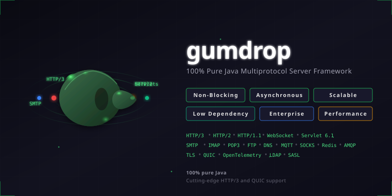

# gumdrop

  

  <em>Multipurpose, asynchronous, non-blocking, event-driven Java networking framework and servlet container</em>

  
  
  
  

---

This is gumdrop, a multipurpose Java networking framework for servers, clients, and mesh P2P applications using asynchronous, reactor-based, non-blocking, event-driven I/O for performance and scalability.

## Why Gumdrop?

- HTTP/3 and QUIC support
    - one of very few Java frameworks with HTTP/3 server support
      (only Netty offers comparable capability; JDK 26's JEP 517 is
      client-only)
    - pure Java (25+) implementation, no native code unlike Netty
    - servlet container runs transparently on top of HTTP/3
- high performance
    - Java NIO non-blocking I/O throughout
    - single-threaded event loops avoid context switching overhead
    - worker thread pool size independent of endpoint count
    - efficient memory usage with ByteBuffers
    - zero-copy file transfers where possible
- scalable architecture
    - handles tens of thousands of concurrent connections per server
    - connection count limited only by OS file descriptors
    - transport-level backpressure provides complete flow control
    - horizontal scaling via cluster session replication
- event-driven design
    - native event-driven architecture, not bolted on
    - callback-based handlers for protocol implementations
    - no blocking operations in I/O path, even async DNS lookups
    - natural fit for distributed, microservices architectures
- small and efficient
    - minimal memory footprint
    - fast startup time
    - modular jar deployment
- simple, extensible interfaces
    - clean separation of protocol handling from business logic
    - implement services without detailed protocol knowledge
    - pluggable authentication via Realm interface
    - pluggable storage via MailboxFactory interface
- low external dependencies, all pure Java
    - [gonzalez](https://github.com/cpkb-bluezoo/gonzalez) : XML
    - [jsonparser](https://github.com/cpkb-bluezoo/jsonparser) : JSON
    - [jprotobuf](https://github.com/cpkb-bluezoo/jprotobuf) : Protocol Buffers
    - [micula](https://github.com/cpkb-bluezoo/micula) : Brotli
    - self-contained implementations (QUIC/HTTP-3, TLS, HPACK, ASN.1, OTel, &c.)
- requires Java 25+ (LTS)
    - UNIX domain socket support available natively
    - no native library or build step required for any feature
- transparent security
    - TLS/DTLS handled automatically by framework
    - configure once, apply to multiple endpoints
    - optional client certificate authentication built-in
    - rate limiting, quotas, IAM
- production ready
    - comprehensive protocol implementations (HTTP, SMTP, IMAP, POP3, FTP, DNS, MQTT, AMQP, SOCKS)
    - security hardening (rate limiting, filtering, attack prevention)
    - enterprise observability via OpenTelemetry integration

### Comparison with other frameworks

| Feature | Gumdrop | Netty | Jetty | Tomcat |
|---------|:-------:|:-----:|:-----:|:------:|
| Servlet container | ✓ | ✗ | ✓ | ✓ |
| Low-level extensible async I/O framework | ✓ | ✓ | ✗ (internal only) | ✗ (internal only) |
| Standard NIO ByteBuffer | ✓ | ✗ (ByteBuf) | ✓ | ✓ |
| HTTP/3 & QUIC, pure Java (no native/JNI) | ✓ | ✗ (native `quiche` via JNI) | ✗ (native `quiche` via JNI) | ✗ |
| SMTP, DNS | ✓ | (clients only, partial) | ✗ | ✗ |
| MQTT broker &amp; client | ✓ | ✗ | ✗ | ✗ |
| IMAP, POP3, FTP, SOCKS | ✓ | ✗ | ✗ | ✗ |
| Transport-level flow control | ✓ | ✓ | ✗ | ✗ |
| Built-in telemetry (no agent) | ✓ | ✗ | ✗ | ✗ |
| Unified auth realm across protocols | ✓ | ✗ | ✗ | ✗ |
| Async client-side DNS resolution | ✓ (built in) | (opt-in `netty-resolver-dns` add-on) | ✗ | ✗ |
| Client I/O worker thread affinity | ✓ | ✓ | ✗ | ✗ |

Gumdrop uniquely combines a servlet container with a complete low-level networking framework, so you can run J2EE web apps and build highly efficient custom protocol servers from the same codebase. Unlike Netty, it uses standard `ByteBuffer` throughout - no proprietary buffer abstraction to learn. Its HTTP layer is built on the same simple and coherent reactor-based event-driven I/O framework used for SMTP, IMAP, DNS, MQTT, AMQP, FTP, and SOCKS, so you can add fully async mail, messaging, file transfer, DNS, or proxy services without bolting on separate stacks.

### Benchmarks

Raw-API HTTP servers (no servlet container) built directly on Gumdrop and on Netty, driven by the same closed-loop load client, on the same machine, over loopback. Each scenario ran a 5s warmup (discarded) followed by two 12s measurement windows; the figures are the average of both. The two servers in a row were always measured back-to-back in the same run, which is what makes the comparison between them meaningful: absolute throughput varies from run to run on a shared development machine, so treat these as directional. "CPU" is the CPU time the server process used per request, in microseconds, the steadier figure when client and server share the same cores. The harness is in [test/benchmark](test/benchmark), which explains how to run it.

With the JDK `HttpClient` as the load client (one virtual thread per concurrent client). On HTTP/1.1 this client, not the server, limits throughput, so these rows mostly show that neither server holds it back:

| Scenario | Concurrency | Req/s (Gumdrop) | Req/s (Netty) | p50 ms (Gumdrop) | p50 ms (Netty) | p99 ms (Gumdrop) | p99 ms (Netty) | CPU µs (Gumdrop) | CPU µs (Netty) |
|---|---:|---:|---:|---:|---:|---:|---:|---:|---:|
| Plaintext HTTP/1.1, keep-alive | 50 | 56,418 | 56,973 | 0.79 | 0.79 | 1.83 | 1.77 | 14.8 | 17.2 |
| Plaintext HTTP/1.1, keep-alive | 200 | 54,677 | 51,565 | 3.47 | 3.74 | 7.01 | 7.47 | 11.6 | 16.7 |
| Plaintext HTTP/1.1, keep-alive | 500 | 52,790 | 49,569 | 5.50 | 6.23 | 29.36 | 28.05 | 11.6 | 16.7 |
| JSON POST/response, HTTP/1.1 | 100 | 49,520 | 48,065 | 1.87 | 1.93 | 4.06 | 4.16 | 19.1 | 20.4 |
| TLS 1.3, HTTP/1.1 keep-alive | 50 | 93,351 | 91,790 | 0.50 | 0.51 | 1.13 | 1.16 | 20.0 | 22.1 |
| TLS 1.3, new connection per request | 20 | 4,960 | 3,262* | 2.82 | 4.29 | 23.33 | 48.23 | 816 | 1,344 |
| TLS 1.3, HTTP/2 (ALPN), keep-alive | 50 | 121,484 | 125,245 | 0.39 | 0.38 | 0.75 | 0.77 | 5.9 | 6.8 |

With lean load clients on blocking sockets (a pre-encoded request and only enough parsing to find the end of each response), which load the servers properly:

| Scenario | Concurrency | Req/s (Gumdrop) | Req/s (Netty) | p50 ms (Gumdrop) | p50 ms (Netty) | p99 ms (Gumdrop) | p99 ms (Netty) | CPU µs (Gumdrop) | CPU µs (Netty) |
|---|---:|---:|---:|---:|---:|---:|---:|---:|---:|
| Plaintext HTTP/1.1, keep-alive | 50 | 149,255 | 141,437 | 0.32 | 0.34 | 0.54 | 0.51 | 13.7 | 15.6 |
| Plaintext HTTP/1.1, keep-alive | 200 | 157,326 | 140,859 | 1.23 | 1.34 | 2.28 | 1.87 | 10.8 | 15.4 |
| Plaintext HTTP/1.1, keep-alive | 500 | 136,981 | 132,163 | 3.54 | 3.74 | 4.39 | 4.52 | 13.3 | 14.4 |
| JSON POST/response, HTTP/1.1 | 100 | 150,957 | 137,653 | 0.63 | 0.69 | 1.56 | 1.00 | 13.3 | 18.0 |
| TLS 1.3, HTTP/1.1 keep-alive | 50 | 128,976 | 130,153 | 0.36 | 0.37 | 0.79 | 0.54 | 19.7 | 21.0 |
| TLS 1.3, new connection per request | 20 | 7,198 | 3,162* | 1.92 | 1.52 | 17.04 | 91.75 | 565 | 791 |
| TLS 1.3, HTTP/2 (ALPN), 50 streams on one connection | 50 | 633,219 | 413,193 | 0.08 | 0.12 | 0.12 | 0.17 | 1.3 | 2.4 |

The same scenarios driven by nghttp2's `h2load`, as a check independent of the harness's own clients, agree: Gumdrop ahead on each, by 14% to 27% on plaintext and JSON, 9% on TLS keep-alive and 18% on HTTP/2, at between a half and two thirds of Netty's CPU per request.

HTTP/3, with Gumdrop's own HTTP/3 client as the load client for both servers (the JDK client does not speak HTTP/3). Netty's QUIC transport here is native code, Cloudflare's quiche with BoringSSL behind JNI; Gumdrop's is Java throughout:

| Scenario | Concurrency | Req/s (Gumdrop) | Req/s (Netty) | p50 ms (Gumdrop) | p50 ms (Netty) | p99 ms (Gumdrop) | p99 ms (Netty) | CPU µs (Gumdrop) | CPU µs (Netty) |
|---|---:|---:|---:|---:|---:|---:|---:|---:|---:|
| HTTP/3, one request at a time per connection | 50 | 43,836 | 39,672 | 1.02 | 1.18 | 1.83 | 1.84 | 25.0 | 24.6 |

\* Netty failed requests in this scenario: about 3% of them with the JDK client and about a quarter with the blocking-socket client, so its figures in these rows are not reliable. Gumdrop failed none. Every other scenario ran error-free on both servers.

Gumdrop is level with or ahead of Netty on plaintext HTTP/1.1, JSON and TLS keep-alive, and uses less CPU per request in each; it resumes TLS sessions, so a client that reconnects pays far less than a full handshake; on HTTP/2 it is within a few percent when the JDK client sets the pace and about half as fast again as Netty, at half the CPU per request, when the client is out of the way; and on HTTP/3 its Java QUIC stack is level with Netty's native one in CPU per request and somewhat ahead in throughput (the HTTP/3 row is the average of four windows). Compression performance was not measured. Measured October 2026 on an Apple M4 with Java 25 and Netty 4.1.121.

## Full feature list

- a generic, extensible server framework that can transparently handle
  secure connections from clients
    - TCP servers with TLS 1.3 and 1.2 support
    - UDP servers with DTLS 1.3 and 1.2 support
    - QUIC support, pure Java implementation (TLS 1.3 always-on)
    - uses standard Java crypto primitives and X.509 cert trust/validation
    - post-quantum TLS 1.3: hybrid ML-KEM key exchange (the default), and
      ML-DSA certificates and handshake signatures
    - SNI
    - configurable pool of worker threads shared across all servers,
      completely independent of the number of client connections
    - transport-level flow control with backpressure for large
      transfers over TCP and QUIC connections
    - internationalization and localization facilities, current translations
      include:
        - English
        - French
        - Spanish
        - German
    - centralized and secure realm interface for authentication and
      authorisation, usable by multiple services, with mTLS and SASL mechanisms
    - CIDR connection filtering, rate limiting, quota features
    - lightweight, simple dependency injection framework
    - client framework for creating clients to communicate with other servers
        - uses same event-driven asynchronous architecture for peers
        - can use I/O worker thread affinity to avoid context switching
- HTTP
    - HTTP/3 over QUIC, 100% pure Java
        - request pseudo-header validation, 1xx informational responses
        - Priority header (RFC 9218), GOAWAY last-stream-ID tracking
        - configurable QUIC transport parameters
        - WebSocket over HTTP/3 (RFC 9220) via Extended CONNECT
    - HTTP/2
        - all HTTP/2 frame types and stream multiplexing
        - graceful GOAWAY, PING keep-alive, SETTINGS ACK timeout, TLS cipher validation
        - client concurrent-stream limiting, idle timeout
    - HTTP/1.0 and 1.1
        - Chunked encoding and persistent connections
        - idle connection timeout, graceful shutdown, Expect: 100-continue
        - OPTIONS * and configurable TRACE method support
    - HTTP client: Connection: close, obs-fold, Content-Length validation, header size limit, Digest SHA-256
        - protocol version negotiation across HTTP/3, HTTP/2 and HTTP/1.1: DNS HTTPS records,
          cached Alt-Svc, ALPN and h2c, with fallback from QUIC to TCP; `versions(...)`
          selects the permitted set
    - MASQUE tunnels over HTTP/3, HTTP/2 and HTTP/1.1
        - CONNECT-UDP (RFC 9298) and CONNECT-IP (RFC 9484) clients
        - HTTP Datagrams and the Capsule Protocol (RFC 9297)
    - authentication framework supporting:
        - Basic
        - HTTP Digest (SHA-256, RFC 7616)
        - Bearer
        - OAuth (token introspection + local JWT validation)
        - mTLS
    - fast async event-driven callback API for microservices with examples
    - 103 Early Hints (RFC 8297) for resource preloading across HTTP/1.1, HTTP/2, and HTTP/3
    - unified flow control over HTTP transports
    - WebDAV file service
        - supports fast NIO based data transfer
        - XML requests and responses streamed in near-constant memory, including
          Multi-Status for PROPFIND, PROPPATCH, LOCK and DELETE
        - PUT and DELETE (including recursive collection DELETE with Multi-Status)
        - RFC 4918 distributed authoring with full If header conditional evaluation
            - PROPFIND, PROPPATCH for live and dead property management
            - dead property storage with xattr primary and sidecar fallback
            - MKCOL, COPY, MOVE for resource operations (with dead property propagation)
            - LOCK, UNLOCK for write locking
        - ACLs integrated with Realm interface
    - complete, conformant Java servlet 6.1 container
        - secure classloader separation
        - separate thread pool configuration for servlet worker threads,
          distinct from I/O worker loops
        - asynchronous processing
        - enterprise DataSource and MailSession handling, JCA connection
          factories, administered objects and all JNDI resources
        - optional hot deployment
        - WebSocket servlet support with example showing how to use upgrade
        - programmatic registration of web descriptors
        - complete multipart/form-data handling
        - annotation-driven configuration and web fragments
        - server push
        - form-based and client certificate authentication in addition to
          base HTTP authentication methods
        - JSP 2.0 implementation
        - cluster session replication with security features:
            - AES-256-GCM encryption with shared secret
            - replay protection via sequence numbers and timestamps
            - per-node sequence tracking with sliding window
            - protobuf serialisation for session attributes
            - deserialisation filtering for complex objects
            - cluster node telemetry metrics
- SMTP
    - SMTPS and STARTTLS support
    - SMTP AUTH with numerous authentication methods for both standard
      clients and enterprise/military environments (see SASL section below)
    - 8-bit clean message transport
    - memory efficient processing of large messages
    - attack prevention features
    - persistent connections
    - transaction reset
    - connection filtering policy settings for MX mode or message submission
        - rate limiting
        - network block lists
        - max connections per IP
        - require authentication
    - extensible pipeline system for processing messages and performing
      authorisation checks:
        - SPF
        - DKIM (verification and signing, RSA-SHA256 and Ed25519-SHA256)
        - DMARC (policy evaluation, aggregate XML reporting, forensic/failure reporting)
        - ARC (RFC 8617 chain validation and sealing for forwarded mail, optional ARC-aware DMARC)
        - custom parsed message processing
    - simple, extensible asynchronous handler mechanism for implementations
    - CHUNKING/BDAT
    - SMTPUTF8 internationalised email addresses
    - Postfix XCLIENT proxy support
    - message delivery requirements
        - Delivery Status Notifications (DSN)
        - REQUIRETLS
        - MT-PRIORITY
        - FUTURERELEASE
        - DELIVERBY
    - LIMITS support
    - SIZE, PIPELINING, 8BITMIME and ENHANCEDSTATUSCODES
    - per-recipient DSN parameters (NOTIFY, ORCPT) available to handlers
    - ETRN command recognition (RFC 1985)
    - SMTP client implementation for MTA forward message delivery
        - step-by-step asynchronous handler interfaces for event-driven
          client
        - supports TLS connections and STARTTLS
        - will use CHUNKING for efficiency if server supports it
        - full EHLO capability parsing (15 extension keywords)
        - MAIL FROM extension parameters (BODY, SMTPUTF8, RET/ENVID, REQUIRETLS, MT-PRIORITY, FUTURERELEASE, DELIVERBY)
        - RCPT TO with DSN parameters (NOTIFY, ORCPT)
        - VRFY and EXPN commands
    - example services for local mailbox delivery and relay, and a compiled
      example server with SPF, DKIM and DMARC checks
- IMAP4rev2
    - complete IMAP4rev2 implementation (RFC 9051), also advertising IMAP4rev1
      so that clients which look only for it will connect
    - IMAPS (implicit TLS on port 993)
    - STARTTLS support
    - full SASL authentication (see SASL section below)
    - multi-folder mailbox support with hierarchical namespaces
    - supported extensions:
        - IDLE (RFC 2177) - push notifications for mailbox changes
        - NAMESPACE (RFC 2342) - personal/shared namespace support
        - QUOTA (RFC 9208) - storage and message quotas
            - respects quotas defined in configuration
        - MOVE (RFC 6851) - atomic message move operations
        - UIDPLUS - extended UID operations
        - UNSELECT - close without expunge
        - CHILDREN - mailbox hierarchy indicators
        - LIST-EXTENDED, LIST-STATUS - enhanced mailbox listing
        - STATUS=SIZE (RFC 8438) - mailbox total size in STATUS
        - COMPRESS=DEFLATE (RFC 4978) - zlib compression after authentication
        - UTF8=ACCEPT (RFC 6855) - UTF-8 mailbox names after ENABLE
        - LITERAL- (RFC 7888) - non-synchronising literals
        - ID (RFC 2971) - server identification
        - CONDSTORE (RFC 7162) - per-message modification sequences
            - MODSEQ in FETCH, SEARCH, and STORE responses
            - UNCHANGEDSINCE conditional STORE
            - HIGHESTMODSEQ in SELECT/EXAMINE/STATUS
        - QRESYNC (RFC 7162) - efficient mailbox resynchronization
            - VANISHED (EARLIER) for expunged UIDs on reconnect
            - session-wide VANISHED instead of EXPUNGE
        - SORT and THREAD (RFC 5256) - ORDEREDSUBJECT and REFERENCES
        - OBJECTID (RFC 8474), BINARY (RFC 3516), PREVIEW (RFC 8970)
        - NOTIFY (RFC 5465) and METADATA (RFC 5464)
    - async FETCH streaming for large message bodies
    - comprehensive SEARCH command with full RFC 9051 syntax
        - flag, date, size, header, body, and MODSEQ searches
        - boolean operators (AND, OR, NOT)
        - sequence sets and UID sets
    - pluggable mailbox backend via standardised API
    - IMAP client with IMAPS and STARTTLS support
        - COMPRESS=DEFLATE (RFC 4978) - `compress()` on authenticated sessions
        - UTF8=ACCEPT (RFC 6855) - `enable(new String[]{"UTF8=ACCEPT"}, …)` for UTF-8 on the wire
        - QUOTA commands (RFC 9208) - GETQUOTA/GETQUOTAROOT
- POP3
    - complete POP3 implementation (RFC 1939)
    - POP3S (implicit TLS on port 995)
    - STARTTLS support (RFC 2595)
    - full SASL authentication (see SASL section below)
    - supported extensions (RFC 2449):
        - UIDL - unique message identifiers
        - TOP - retrieve message headers
        - USER/PASS - plaintext authentication
        - CAPA - capability advertisement
        - UTF8 (RFC 6856) - internationalized mailboxes
        - RESP-CODES (RFC 2449) - extended error response codes
        - AUTH-RESP-CODE (RFC 3206) - authentication error codes
        - EXPIRE, LOGIN-DELAY (RFC 2449) - policy advertisement
    - pluggable mailbox backend via standardised API
    - session isolation through the mailbox backend (file locking for mbox)
    - POP3 client with POP3S and STLS support
- mailbox API
    - mbox backend
    - Maildir++ backend
    - extensible for custom backends
    - security features
    - mailbox indexing for fast IMAP search
- FTP
    - FTPS (implicit TLS on port 990)
    - explicit TLS via AUTH TLS/SSL (RFC 4217)
        - control channel encryption
        - PBSZ/PROT commands for data channel protection
        - PROT P for encrypted data transfers
        - data connection IP verification (RFC 4217 section 10)
        - FEAT command for capability advertisement
    - SIZE, MDTM, MLST/MLSD machine-readable listings (RFC 3659)
    - UTF-8 pathnames via OPTS (RFC 2640)
    - STAT directory listing over control connection
    - full IPv6 support (RFC 2428)
        - EPRT command for extended active mode
        - EPSV command for extended passive mode
        - automatic protocol detection (IPv4/IPv6)
        - EPSV ALL mode for IPv6-only clients
    - quota support
        - SITE QUOTA command
        - SITE SETQUOTA command
    - pluggable realm authentication via standardised mechanism
    - extensible, customizable virtual filesystem
        - local filesystem implementation provided with secure chroot, cross
          platform, configurable read/write permissions
        - extensible for cloud/database resource access
        - uses high performance NIO channels for data transfer
    - simple application handler, abstracted away from protocol details
    - supports binary and ASCII transfer modes
    - passive and active transfer modes
    - resume and append support
    - allows abort to cancel in-progress transfers
    - fully functional FTP file service implementation
- WebSockets
    - server and client built on top of HTTP transports, with the client
      falling back from QUIC to TCP like the HTTP client
    - unified socket handler interface
    - extension negotiation framework (RFC 6455 §9) with permessage-deflate
      compression (RFC 7692)
    - WebSocket over HTTP/3 (RFC 9220) and HTTP/2 (RFC 8441) via Extended
      CONNECT, unified with the HTTP/1.1 upgrade path in
      `WebSocketRequestHandler`
    - configurable maximum message size with close code 1009 enforcement
    - close code validation (RFC 6455 §7.4) rejecting reserved wire codes
    - SecureRandom masking keys (RFC 6455 §5.3)
- MQTT
    - full MQTT message broker and client
    - MQTT 3.1.1 and MQTT 5.0 (simultaneous version negotiation)
    - all packet types and QoS levels (0, 1, 2)
    - MQTTS (MQTT over TLS on port 8883)
    - MQTT over WebSocket for browser-based clients
    - SAX-style incremental parser — streams PUBLISH payloads up to 256 MB
      without buffering entire packets in memory
    - pluggable NIO channel-based message store for payload persistence
        - default in-memory store with fast path for small messages
        - override for file-backed or distributed storage
    - horizontal fan-out: payload chunks read once and broadcast to all
      subscribers, minimising I/O for high fan-out topics
    - topic wildcard matching (`+` single-level, `#` multi-level) via trie-based TopicTree
    - retained messages, Last Will and Testament
    - clean session management
    - MQTT 5.0 properties (user properties, content type, message expiry,
      authentication method/data, reason codes)
    - staged handler pattern for async connection, publish, and subscribe
      authorisation
    - default service accepts all connections (with optional realm authentication)
    - broker components: SubscriptionManager, RetainedMessageStore, WillManager, QoSManager
    - fully asynchronous MQTT client with SelectorLoop affinity
        - TLS support
        - QoS 0, 1, 2 publish and subscribe
        - Last Will and Testament
        - MQTT 5.0 version negotiation
        - MqttMessageContent delivery for streaming large received payloads
    - OpenTelemetry instrumentation (connections, publishes, subscribes,
      authentication, session duration, payload size)
    - localized log and error messages (English, French, Spanish, German)
- DNS
    - full DNS server implementation
    - DNS over DTLS for secure queries
    - DoT: DNS over TLS with session resumption, TCP Fast Open, SPKI pinning,
      connection pooling
    - DoQ: DNS over QUIC with error codes, 0-RTT, connection reuse, padding
    - DoH: DNS over HTTPS
    - EDNS0 support with DNS cookies (RFC 7873)
    - DNS message compression (RFC 1035 section 4.1.4)
    - upstream proxying with response ID validation and TCP fallback
    - caching forwarder (`UpstreamRelayHandler`) with TTL cache, RFC 8767
      serve-stale, RFC 8020 NXDOMAIN cut, and RFC 8198 aggressive use of
      DNSSEC-validated NSEC/NSEC3 proofs when DNSSEC validation is enabled
    - authoritative server (`AuthoritativeZoneHandler`) with BIND-style
      zone files (SOA/NS/A/AAAA/CNAME/MX/TXT/PTR, wildcards, RFC 2308
      negative answers, in-zone CNAME chains, glue records)
    - DNSSEC validation (RFC 4033-4035, RFC 5155)
        - EDNS0 DO bit, AD/CD flags
        - RRSIG signature verification (RSA-SHA256/512, ECDSA P-256/P-384,
          Ed25519, Ed448)
        - DS digest verification (SHA-1, SHA-256, SHA-384)
        - chain-of-trust validation with async DNSKEY/DS fetching
        - NSEC and NSEC3 authenticated denial-of-existence
        - configurable trust anchors (IANA root KSK pre-loaded)
        - all crypto CPU-bound, NIO-safe
    - all record types
    - flexible async client resolver
        - UDP, TCP, DoT, DoQ, DoH transports
- SOCKS proxy
    - SOCKS4, SOCKS4a, and SOCKS5 (RFC 1928) protocol support
    - auto-detection of SOCKS version from first byte
    - SOCKS5 authentication methods:
        - no authentication
        - username/password (RFC 1929)
        - GSSAPI/Kerberos (RFC 1961) via existing SASL infrastructure
    - pluggable realm authentication via standardised mechanism
    - async connect authorisation handler for custom policies
    - CIDR-based destination allow/block filtering
    - bidirectional TCP relay with transport-level backpressure
    - SelectorLoop affinity — upstream connections share the client's
      event loop thread for lock-free relaying
    - configurable max concurrent relays and idle relay timeout
    - fully async, non-blocking — DNS resolution, upstream connect, and
      TLS handshake all handled asynchronously
    - abstract SocksServer for custom implementations
    - DefaultSOCKSServer for zero-config operation
    - composable SOCKS client handler for tunneling any protocol through
      a SOCKS proxy (HTTP, SMTP, IMAP, MQTT, Redis, LDAP, etc.)
- OpenTelemetry and logging
    - native implementation (no OpenTelemetry SDK required)
    - structured log events with levels, routed to composable exporters:
      console (java.util.logging), OTLP, JSONL, HTTP access log (CLF/ELFF)
      and QUIC qlog
    - one TelemetryConfig per runtime; asynchronous delivery that never
      blocks connection threads
    - distributed tracing with W3C Trace Context propagation
    - metrics collection (counters, histograms, gauges)
    - OTLP/HTTP and OTLP/gRPC export to any OpenTelemetry Collector
    - file export for JSONL
    - built-in instrumentation for HTTP, SMTP, IMAP, POP3, FTP, MQTT
    - endpoint pooling with SelectorLoop affinity
    - configurable aggregation temporality (delta/cumulative)
    - custom instrumentation API for application-level tracing
- SASL authentication
    - centralized, extensible realm interface
        - decouples credentials, authentication, authorisation from
          protocols
        - does not expose passwords by default
        - extensible for LDAP, identity providers, databases
    - modern authentication mechanisms supported (the MD5-based CRAM-MD5, DIGEST-MD5 and APOP are intentionally not supported)
        - PLAIN (requires TLS)
        - LOGIN (requires TLS)
        - SCRAM-SHA-256 (recommended!)
        - OAUTHBEARER (requires TLS)
        - GSSAPI/Kerberos (RFC 4752) — keytab-based, event-loop safe
        - EXTERNAL for TLS client certificates
- LDAP client and LdapRealm
    - fully asynchronous LDAPv3 client (RFC 4511)
    - simple bind (RFC 4513 §5.1) and SASL bind (RFC 4513 §5.2)
        - PLAIN, EXTERNAL - all non-blocking
        - GSSAPI/Kerberos — worker-thread offloaded for KDC contact
    - LDAPS (implicit TLS) and STARTTLS
    - search, modify, add, delete, compare, modifyDN, extended operations
    - abandon, controls (request/response), unsolicited notifications
    - intermediate response handling, full search filter support (~=, :=)
    - LdapRealm for LDAP-backed authentication across all protocols
        - search-then-bind pattern with configurable user filter
        - role/group membership via memberOf attribute
        - certificate-to-user mapping (binary or subject DN mode)
        - Active Directory compatible
- AMQP client
    - AMQP 0-9-1 client for publishing and consuming messages against
      brokers such as RabbitMQ
    - exchange/queue declaration, binding, publish, and consume
    - publisher confirms and classic transactions (tx.select/commit/rollback)
    - streaming, chunked message body publishing (no full-buffer materialisation)
    - automatic connection recovery with configurable exponential backoff,
      and transparent replay of exchanges, queues, bindings, and consumers
    - implicit TLS (AMQPS) and SASL PLAIN, AMQPLAIN, EXTERNAL, and GSSAPI
      (Kerberos) authentication mechanisms
    - SelectorLoop affinity for server integration
- AMQP 1.0 client
    - SASL security layer (PLAIN, ANONYMOUS, EXTERNAL, or any
      `SaslClientMechanism`) and implicit TLS (AMQPS)
    - connections, sessions, and sender and receiver links, exposed through
      typed state interfaces so out-of-order calls fail to compile
    - streaming, incremental message transfer in both directions: a large
      message is framed and sent as it is produced, and delivered to the
      application as it arrives, never assembled in memory
    - link credit, session windows, and explicit dispositions (accepted,
      rejected, released, modified) with unsettled and pre-settled deliveries
    - idle-timeout keepalives in both directions
    - automatic reconnection with exponential backoff
- Redis client
    - RESP2 and RESP3 protocol support (HELLO for protocol negotiation)
    - Redis 6+ ACL auth, CLIENT SETNAME/GETNAME/ID, RESET
    - full message subscription with pattern matching (RESP3 Push type)
    - SCAN/HSCAN/SSCAN/ZSCAN cursor-based iteration
    - blocking commands (BLPOP, BRPOP, BLMOVE)
    - Redis Streams (XADD, XREAD, XRANGE, XLEN, XTRIM, XACK, XGROUP, XPENDING)
    - TLS support, fully async, pipelining
- gRPC service and client
    - efficient event based processing of .proto definitions, using
      [jprotobuf](https://github.com/cpkb-bluezoo/jprotobuf)
    - unary calls with typed status codes; the call API is shaped to take
      streaming, metadata and deadlines later without breaking changes
    - no stubs or external dependencies required
    - operates over HTTP/2 or HTTP/3

## Documentation

There is extensive documentation for all Gumdrop features:

- The [example web application](https://cpkb-bluezoo.github.io/gumdrop/web/) contains detailed documentation for all features
- [Javadoc package and class documentation](https://cpkb-bluezoo.github.io/gumdrop/doc/)
- [RFC compliance matrix](RFC-COMPLIANCE.md) showing extent of support for mandatory and optional RFC features
- [Framework comparison](docs/FRAMEWORK-COMPARISON.md) — deployment size and speed vs Netty, Jetty, Tomcat, Spring Boot
- [Cloud container deployment](docs/CONTAINER-DEPLOYMENT.md) — Docker/Podman/Kubernetes for custom Gumdrop apps and the optional servlet-container image; lifecycle, sizing, and scaling (local servlet smoke: [BUILDING.md](BUILDING.md))

## Configuration

See the [Composition documentation](https://cpkb-bluezoo.github.io/gumdrop/web/configuration.html) for details on assembling servers, listeners, and handlers in Java. For the in-tree TLS/DTLS stack (versions, cipher suites, ALPN, SNI, mTLS), see [TLS & DTLS](https://cpkb-bluezoo.github.io/gumdrop/web/tls.html). For TLS certificates (HTTPS, HTTP/3, local development with mkcert), see the [Security documentation](https://cpkb-bluezoo.github.io/gumdrop/web/security.html#tls).

## Building and running

For build and run instructions, see [BUILDING.md](BUILDING.md).

## Logo

The gumdrop logo is a gumdrop torus, generated using [POV-Ray](http://www.povray.org/).
A gumdrop torus is a [mathematical construct](http://www.povray.org/documentation/view/3.6.1/448/#s02_07_07_02_i75)
 - the gumdrop logo is such a torus viewed from an angle that makes it resemble
the letter G. All logo images were created using POV-Ray and/or Gimp and are
copyright 2005 Chris Burdess.

## Licensing

Gumdrop is licensed under the GNU Lesser General Public Licence version 3.
See `COPYING` for full terms.

-- Chris Burdess
